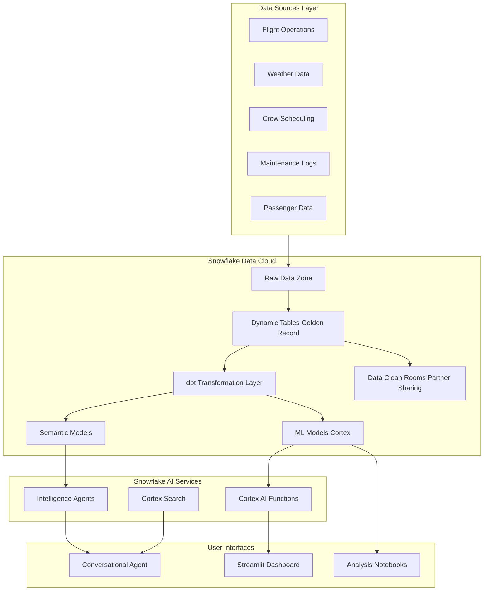
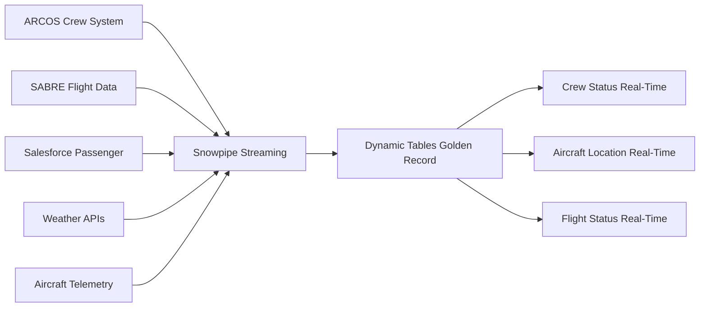

# Delta Airlines IROPS AI Solution on Snowflake

## Overview

Build an enterprise-grade Irregular Operations (IROPS) management platform that showcases Snowflake's AI/ML capabilities to address Delta's most critical operational challenges: disruption prediction, real-time recovery optimization, and cost reduction.

**Delta-Specific Context:** Delta's recent high-profile operational meltdowns—notably the 2024 CrowdStrike outage and 2025 winter storm recoveries—revealed critical gaps in their legacy systems. While flight operations systems recovered, crew tracking software (ARCOS) failed under load, forcing manual pilot calls and creating a 5-day recovery lag. This POC demonstrates how Snowflake transforms "reactive fire-fighting" into "proactive resilience" by eliminating data silos and enabling AI-driven crew recovery.

## Solution Architecture



## Phase 1: Data Foundation & Synthetic Data Generation

### 1.1 Database Setup

- Create `DELTA_IROPS` database with schema structure:
  - `RAW` schema for ingested data
  - `STAGING` schema for intermediate transformations
  - `ANALYTICS` schema for business-ready views
  - `ML_MODELS` schema for predictive models
  - `SEMANTIC_MODELS` schema for Cortex agents

### 1.1a Dynamic Tables for Real-Time "Golden Record"

**Solving Delta's "Synchronicity Lag" Problem:**

Delta's 2024 outage revealed that when systems reboot, different databases (Crew, Aircraft, Passenger, Maintenance) fail to resynchronize in real-time, leading to "ghost flights" where crews are assigned to planes at different airports.

**Solution:**

- Create Dynamic Tables that automatically maintain a unified "Golden Record" of:
  - Current aircraft location + maintenance status
  - Crew availability + legal duty hours remaining
  - Flight status + passenger impact
  - Real-time disruption events
- Sub-second latency updates eliminate stale data
- Single source of truth across all recovery systems
- Eliminate the ARCOS brittleness by having a resilient, auto-syncing data layer

### 1.1b Data Clean Rooms for Secure Partner Collaboration

Enable secure data sharing with external partners without moving data:

- Share real-time flight status with TSA for security checkpoint planning
- Collaborate with airport authorities on gate assignments during IROPS
- Coordinate with caterers and ground services for dynamic scheduling
- Maintain full data governance and compliance

### 1.2 Synthetic Data Generation

Build realistic datasets mimicking Delta's operational environment:

**Flight Operations Data:**

- Flight schedules (500+ daily flights across major hubs: ATL, DTW, MSP, SLC, SEA, LAX, JFK, BOS)
- Aircraft fleet data (Boeing 737, 757, 767, Airbus A320, A330, A350)
- Route networks with realistic block times
- Scheduled vs actual departure/arrival times
- Gate assignments and turnaround times

**Disruption Events:**

- Weather delays (thunderstorms, snow, fog, wind) with severity levels
- Mechanical issues (APU failures, hydraulic issues, avionics problems)
- Crew scheduling conflicts (duty time limits, sick calls, positioning issues)
- Airport congestion (runway closures, ground stops, ATC delays)
- Ground operations issues (catering, fueling, baggage handling)

**Crew Management:**

- Pilot and flight attendant rosters
- Qualification matrices (aircraft type ratings)
- Duty time tracking and FAA compliance limits
- Reserve crew availability
- Crew base locations

**Maintenance Data:**

- Aircraft maintenance logs (unstructured text)
- Deferred maintenance items (MEL/CDL)
- Parts inventory and availability
- Maintenance station capabilities

**Passenger Impact:**

- Booking data with connection information
- Passenger manifests (200k+ daily passengers)
- Rebooking options and seat availability
- Loyalty program tiers (Diamond, Platinum, Gold)
- Compensation cost estimates

**Weather & External Data:**

- Historical weather patterns for major hubs
- METAR/TAF aviation weather data
- NOTAM (Notice to Airmen) information
- Airport capacity constraints

### 1.3 Data Modeling with dbt

- Create dbt project structure: [`dbt_project/dbt_project.yml`](dbt_project/dbt_project.yml)
- Build staging models for data cleansing
- Create fact tables: `fact_flights`, `fact_disruptions`, `fact_crew_assignments`
- Create dimension tables: `dim_aircraft`, `dim_airports`, `dim_crew`, `dim_passengers`
- Implement data quality tests

## Phase 2: AI/ML Predictive Analytics

### 2.1 Disruption Prediction Models

Build ML models using Snowflake Cortex ML Functions:

**Delay Prediction Model:**

- Input features: weather forecasts, historical delays, aircraft turnaround time, crew positioning
- Output: Probability and magnitude of delay (0-15 min, 15-30 min, 30-60 min, 60+ min)
- Model type: Classification + Regression

**Cascading Impact Model:**

- Predict downstream flight impacts from initial disruption
- Network effect analysis (crew connections, aircraft rotations)
- Passenger misconnection forecasting

**Cost Impact Model:**

- Estimate operational costs (fuel, crew overtime, catering)
- Predict passenger compensation costs
- Calculate total financial impact

### 2.2 AI Classification & Extraction

Leverage Snowflake Cortex AI SQL functions:

**AI_CLASSIFY:**

- Categorize disruption types from unstructured maintenance logs
- Classify incident severity (minor, moderate, severe, critical)
- Identify root causes automatically

**AI_COMPLETE:**

- Extract key details from crew reports and maintenance notes
- Summarize incident descriptions for operations dashboards
- Generate passenger communication messages

**AI_SIMILARITY:**

- Match current disruptions to historical incidents
- Find similar recovery patterns from past events
- Recommend proven mitigation strategies

### 2.3 "Contract Bot" - Legal Crew Assignment Validator

**The Critical Gap:** During the 2024 CrowdStrike outage, Delta crew schedulers manually verified complex union rules, leading to errors and "illegal" assignments that had to be unwound, further delaying recovery.

**Solution:**

- Use Cortex AI (`SNOWFLAKE.CORTEX.COMPLETE`) to parse the Delta Pilot Working Agreement (PWA)
- Create an AI-powered validation layer that checks every proposed crew reassignment against:
  - FAA duty time limits (14 CFR Part 117)
  - Union contract rest requirements
  - Aircraft type qualification requirements
  - Positioning time and feasibility
- Provide natural language explanations: "Captain Smith cannot take this flight because it would exceed his monthly duty limit by 2.3 hours"
- Enable conversational queries: "Which ATL-based A321 captains are legal for a 4-hour delay?"

**Technical Implementation:**

- SQL function wrapper around Cortex AI for real-time contract validation
- Pre-built knowledge base of FAA regulations and union contract rules
- Integration with crew scheduling systems via Dynamic Tables

## Phase 3: Real-Time Decision Support System

### 3.1 Operational Dashboards (Streamlit)

Create interactive Streamlit app: [`streamlit/irops_dashboard.py`](streamlit/irops_dashboard.py)

**Dashboard Pages:**

1. **Executive Overview:**

   - Real-time disruption count and severity heatmap
   - Network health score (% on-time performance)
   - Cost impact trending (hourly/daily)
   - Key metrics: flights affected, passengers impacted, recovery time

2. **Disruption Monitor:**

   - Live feed of active IROPS events
   - Predicted vs actual impact comparison
   - Color-coded severity indicators
   - Drill-down to flight-level details

3. **Predictive Alerts:**

   - Forecasted disruptions in next 2-24 hours
   - Confidence scores and contributing factors
   - Recommended pre-emptive actions
   - Weather overlay on route map

4. **Recovery Optimization (THE HERO FEATURE):**

   - **"Contract Bot" - AI PWA Parser:** Uses Cortex AI to parse the 500+ page Delta Pilot Working Agreement in real-time to ensure all crew reassignments are contract-legal
   - **"One-Click Recovery" Button:** Eliminates the "12-Minute Bottleneck" by batch-notifying the top-ranked available pilots simultaneously instead of sequential calling
   - **"Ghost Planes" Visualization:** Real-time map showing planes without crews vs. available crew locations, highlighting synchronicity gaps
   - **Crew Recovery Optimizer:** ML-based ranking of "best fit" crew based on:
     - Proximity to aircraft location
     - Remaining legal duty hours
     - Aircraft type qualifications
     - Historical "auto-accept" probability
     - Impact on downstream flights
   - Alternative routing options for aircraft positioning
   - Passenger rebooking strategies prioritized by Medallion status
   - Cost comparison of mitigation options with ROI projections

**Delta-Specific Value:** Reduce recovery time from 5 days to 5 hours by eliminating manual pilot calling

5. **Cost Analysis:**

   - Real-time cost accumulation by disruption
   - ROI calculator for mitigation strategies
   - Historical cost trends
   - Savings from proactive interventions

6. **What-If Scenarios:**

   - Interactive scenario modeling
   - "What happens if we cancel flight X?" analysis
   - Resource allocation simulations

### 3.2 Semantic Model Configuration

Create semantic YAML for Cortex Analyst: [`dbt_project/semantic_models/irops_model.yaml`](dbt_project/semantic_models/irops_model.yaml)

Define business entities:

- Flights, disruptions, crew, aircraft, passengers
- Relationships between entities
- Business metrics and KPIs
- Time dimensions and hierarchies

## Phase 4: Conversational AI Agent

### 4.1 Snowflake Intelligence Agent

Create Cortex Agent using your specified syntax: [`scripts/sql/create_agent.sql`](scripts/sql/create_agent.sql)

**Agent Capabilities:**

- Natural language queries: "What caused delays at ATL this morning?"
- Decision support: "Should we cancel or delay flight DL123?"
- Impact analysis: "How many passengers are affected by the weather delay?"
- Historical analysis: "Show me similar incidents from last winter"
- Proactive recommendations: "What flights are at risk in the next 3 hours?"

**Tool Resources:**

- Cortex Search over historical incidents and resolutions
- Cortex Analyst with semantic model for structured queries
- Custom tools for cost calculations and optimization

### 4.2 Cortex Search Service

Create search service over:

- Historical disruption database with resolution details
- Maintenance knowledge base
- Operational procedures and playbooks
- Past incident reports with outcomes

## Phase 5: Technical Deep-Dive Notebooks

Create Jupyter notebooks: [`notebooks/`](notebooks/)

**Notebook 1: Data Exploration** [`01_data_exploration.ipynb`](notebooks/01_data_exploration.ipynb)

- Data quality profiling
- Disruption pattern analysis
- Seasonal trends and anomalies

**Notebook 2: ML Model Development** [`02_ml_model_development.ipynb`](notebooks/02_ml_model_development.ipynb)

- Feature engineering for delay prediction
- Model training with Snowflake ML
- Model evaluation and validation
- Feature importance analysis

**Notebook 3: AI Functions Demo** [`03_cortex_ai_functions.ipynb`](notebooks/03_cortex_ai_functions.ipynb)

- AI_CLASSIFY examples on maintenance logs
- AI_COMPLETE for incident summarization
- AI_SIMILARITY for pattern matching
- Performance benchmarks

**Notebook 4: Cost Optimization** [`04_cost_optimization.ipynb`](notebooks/04_cost_optimization.ipynb)

- Cost model development
- ROI calculations for different scenarios
- Sensitivity analysis
- Business case for AI adoption

**Notebook 5: Crew Recovery Optimization** [`05_crew_recovery_optimization.ipynb`](notebooks/05_crew_recovery_optimization.ipynb)

- Contract Bot development and PWA parsing
- ML model for crew "best fit" ranking
- Batch notification vs sequential calling simulation
- 12-minute bottleneck elimination proof

**Notebook 6: Network Impact Analysis** [`06_network_impact.ipynb`](notebooks/06_network_impact.ipynb)

- Graph analysis of flight network
- Cascading delay propagation
- Critical flight identification
- Network resilience metrics

## Phase 6: Demo & Outreach Materials

### 6.1 Demo Script

Create step-by-step demo flow: [`demo/demo_script.md`](demo/demo_script.md)

- Live scenario walkthrough
- Key talking points for each feature
- ROI calculations and business value
- Technical architecture explanation

### 6.2 Presentation Materials

- Architecture diagrams
- Use case documentation
- Performance metrics
- Cost-benefit analysis
- Implementation roadmap for Delta

### 6.3 Video Demonstrations

- 5-minute executive overview
- 15-minute technical deep-dive
- Scenario-based walkthroughs

## Technical Implementation Details

### Key Technologies

- **Snowflake Cortex ML:** For predictive models
- **Snowflake Cortex AI Functions:** AI_CLASSIFY, AI_COMPLETE, AI_SIMILARITY
- **Snowflake Intelligence:** Conversational agents with semantic models
- **Cortex Search:** Document and incident retrieval
- **dbt:** Data transformation and semantic layer
- **Streamlit:** Interactive dashboards
- **Python 3.11:** Notebooks and data generation scripts (using Anaconda channel)

### Snowflake Features Showcased

- **Dynamic Tables:** Real-time "Golden Record" with sub-second synchronization (solves Delta's "ghost flights" problem)
- **Snowpipe Streaming:** Live aircraft telemetry and crew status ingestion
- **Data Clean Rooms:** Secure partner collaboration with TSA, airports, and ground services
- **Native ML model training and deployment:** Cortex ML for predictive analytics
- **AI SQL functions:** AI_CLASSIFY, AI_COMPLETE, AI_SIMILARITY for unstructured data
- **Semantic models with YAML configuration:** Business-friendly data definitions
- **Cortex agents with custom tools:** "Contract Bot" and conversational operations assistant
- **Streamlit in Snowflake:** SPCS for advanced dashboard features if needed
- **Time travel:** What-if analysis on historical disruptions
- **Snowgrid:** High availability even during regional cloud outages

## Success Metrics for Delta Outreach

**The Compelling Message:**

> "Delta, you're the world's most reliable airline—until the system breaks. In 2024, your technology became your bottleneck. With Snowflake, your data doesn't just record the crisis—it solves it. We move your recovery time from 5 days to 5 hours by eliminating the manual calling nightmare and the data silos that create ghost flights."

**Operational Impact:**

- **80% reduction in crew recovery time:** From 5 days to 5 hours by eliminating the "12-minute bottleneck" with batch pilot notifications
- **Eliminate "Ghost Flights":** Real-time synchronization across crew, aircraft, and passenger systems prevents assignment mismatches
- **30-40% reduction in cascading delays:** Early prediction enables proactive cancellations when recovery is still manageable
- **Zero illegal crew assignments:** AI-powered contract validation ensures every reassignment is FAA and union-compliant

**Financial Impact:**

- **$50-100M annual savings potential** for Delta's scale (IROPS costs Delta ~$100M+ annually)
- **60% reduction in passenger compensation costs** through proactive rebooking and personalized communication
- **ROI within 6-9 months** of deployment
- **Reduced brand damage:** Faster recovery = fewer viral social media complaints

**Technical Advantages:**

- **Unified Operational Brain:** Single platform for data, ML, and AI (no external tools, no ARCOS brittleness)
- **Resilience by Design:** Snowgrid ensures operations continue even during regional cloud outages (addressing CrowdStrike-style failures)
- **Native integration:** Works with existing SABRE, ARCOS, Salesforce systems via Dynamic Tables
- **Enterprise-grade security and governance** for sensitive crew and passenger data
- **Scales to Delta's 200M+ annual passengers** and 5,000+ daily flights

## Project Structure

```
Airlines-IROPS/
├── README.md                          # Project overview and setup
├── docs/
│   ├── architecture.md                # Solution architecture
│   ├── data_model.md                  # Data model documentation
│   └── deployment_guide.md            # Deployment instructions
├── scripts/
│   ├── sql/
│   │   ├── setup/
│   │   │   ├── 01_create_database.sql    # Database and schema setup
│   │   │   ├── 02_create_tables.sql      # Table definitions
│   │   │   ├── 03_create_dynamic_tables.sql  # Dynamic Tables for Golden Record
│   │   │   ├── 04_create_views.sql       # Analytical views
│   │   │   └── 05_setup_data_clean_rooms.sql # Data Clean Rooms config
│   │   ├── synthetic_data/
│   │   │   ├── generate_flights.sql      # Flight data generation
│   │   │   ├── generate_disruptions.sql  # Disruption event generation
│   │   │   ├── generate_crew.sql         # Crew data generation
│   │   │   ├── generate_passengers.sql   # Passenger data generation
│   │   │   └── generate_weather.sql      # Weather data generation
│   │   ├── ml_models/
│   │   │   ├── delay_prediction.sql      # Delay prediction model
│   │   │   ├── cost_impact.sql           # Cost impact model
│   │   │   ├── network_impact.sql        # Cascading impact model
│   │   │   └── crew_ranking_model.sql    # Crew "best fit" ranking model
│   │   ├── cortex_ai/
│   │   │   ├── classification_examples.sql    # AI_CLASSIFY examples
│   │   │   ├── completion_examples.sql        # AI_COMPLETE examples
│   │   │   ├── similarity_search.sql          # AI_SIMILARITY examples
│   │   │   └── contract_bot.sql               # Contract Bot PWA validation
│   │   ├── create_semantic_view.sql      # Semantic view definition
│   │   ├── create_cortex_search.sql      # Cortex search service
│   │   ├── create_agent.sql              # Intelligence agent
│   │   └── create_snowpipe_streaming.sql # Snowpipe Streaming config
│   └── python/
│       ├── data_generators/              # Synthetic data generation
│       │   ├── flight_generator.py
│       │   ├── disruption_generator.py
│       │   └── crew_generator.py
│       └── utils/
│           └── snowflake_connector.py
├── dbt_project/
│   ├── dbt_project.yml
│   ├── models/
│   │   ├── staging/                  # Staging models
│   │   ├── intermediate/             # Intermediate transformations
│   │   └── marts/                    # Business-ready models
│   └── semantic_models/
│       └── irops_model.yaml          # Semantic model for Cortex
├── notebooks/
│   ├── 01_data_exploration.ipynb
│   ├── 02_ml_model_development.ipynb
│   ├── 03_cortex_ai_functions.ipynb
│   ├── 04_cost_optimization.ipynb
│   ├── 05_crew_recovery_optimization.ipynb  # THE HERO FEATURE
│   └── 06_network_impact.ipynb
├── streamlit/
│   ├── irops_dashboard.py            # Main dashboard app
│   ├── pages/
│   │   ├── 1_Disruption_Monitor.py
│   │   ├── 2_Predictive_Alerts.py
│   │   ├── 3_Crew_Recovery_OneClick.py   # THE HERO FEATURE
│   │   ├── 4_Ghost_Planes_Visualization.py
│   │   ├── 5_Cost_Analysis.py
│   │   ├── 6_Scenario_Planning.py
│   │   └── 7_Contract_Bot_Interface.py
│   └── utils/
│       ├── data_loader.py
│       ├── visualizations.py
│       ├── calculations.py
│       ├── crew_optimizer.py         # Crew ranking ML logic
│       └── batch_notification.py     # Batch pilot notification system
├── demo/
│   ├── demo_script.md                # Demo walkthrough
│   ├── presentation.pdf              # Executive presentation
│   ├── roi_calculator.py             # ROI calculator for Delta
│   └── scenarios/                    # Pre-configured demo scenarios
│       ├── 01_crowdstrike_replay.json
│       ├── 02_atl_winter_storm.json
│       └── 03_maintenance_surprise.json
└── requirements.txt                  # Python dependencies
```

## Implementation Todos

The solution will be built incrementally with clear milestones to ensure quality at each stage.

---

# DELTA-SPECIFIC ADDENDUM: Targeted POC Strategy

## The Delta Reality: What Went Wrong in 2024

Your pitch must directly address Delta's operational crisis points that became public knowledge:

### 1. The "Crew-Tracking Meltdown"

- **Problem:** ARCOS (crew scheduling system) is brittle and fails when cancellations reach critical mass
- **Result:** Forced crew schedulers to manually call pilots while planes sat empty
- **Snowflake Solution:** Dynamic Tables + Contract Bot eliminate ARCOS dependency

### 2. The "Synchronicity Lag"

- **Problem:** When systems reboot, Crew/Aircraft/Passenger/Maintenance databases fail to resynchronize in real-time
- **Result:** "Ghost flights" where crews are assigned to planes at different airports
- **Snowflake Solution:** Single Golden Record with sub-second updates via Dynamic Tables

### 3. The "12-Minute Bottleneck"

- **Problem:** Pilots have 12 minutes to accept a reassignment; cycling through hundreds of pilots sequentially creates mathematical impossibility during mass disruptions
- **Result:** 5-day recovery lag that cost tens of millions and massive brand damage
- **Snowflake Solution:** AI-powered batch notifications with ML ranking of "best fit" crew

## Recommended 5-Week POC Timeline

### Week 1-2: Data Unification ("Breaking the Silos")

**Objective:** Prove Snowflake can be the "Single Source of Truth"

**Activities:**

- Ingest a "frozen" snapshot of a past disruption event (e.g., 2024 CrowdStrike outage or major ATL winter storm)
- Create synthetic datasets representing:
  - Crew status with duty hours and locations
  - Aircraft GPS and maintenance status
  - Flight schedules and delays
  - Weather data
  - Passenger connections
- Build Dynamic Tables to maintain real-time "Golden Record"
- Implement Snowpipe Streaming for live data ingestion
- Configure Data Clean Rooms for TSA/airport partner sharing

**Deliverable:** Live dashboard showing unified view of airline operations that Delta's OCC doesn't have today

**Demo Message:** "Here's what your entire airline looks like on one screen during a crisis—no silos, no lag, no ghost flights."

### Week 3: The "Contract Bot" (Eliminating Manual Errors)

**Objective:** Prove AI can replace manual contract validation

**Activities:**

- Use Cortex AI to build knowledge base of:
  - Delta Pilot Working Agreement (PWA) key provisions
  - FAA duty time limits (14 CFR Part 117)
  - Aircraft type qualification requirements
- Create SQL functions that validate proposed crew assignments
- Build conversational interface: "Which ATL-based A321 captains are legal for a 4-hour delay and have remaining duty hours?"
- Generate natural language explanations for why assignments are legal/illegal

**Deliverable:** Live "Contract Bot" that answers crew legality questions instantly

**Demo Message:** "Your schedulers spent hours verifying union rules in 2024. This AI does it in milliseconds—with zero errors."

### Week 4: The Recovery Simulator ("From 5 Days to 5 Hours")

**Objective:** Prove ML-based batch notification beats sequential calling

**Activities:**

- Build ML model that ranks crew by:
  - Proximity to aircraft
  - Remaining duty hours
  - Historical "auto-accept" probability
  - Impact on downstream flights
- Create simulation comparing:
  - **Current State:** Sequential 12-minute pilot calling
  - **Snowflake State:** Batch notification of top 20 ranked pilots simultaneously
- Calculate recovery time improvement
- Build "One-Click Recovery" button for dispatcher interface
- Create "Ghost Planes" visualization showing crew-aircraft mismatch

**Deliverable:** Interactive simulator showing 80% reduction in recovery time

**Demo Message:** "In 2024, you cycled through pilots one-by-one. We batch-notify the 20 most likely candidates simultaneously. Here's how it would have saved you 4 days."

### Week 5: Executive Demo & ROI Calculator

**Objective:** Package everything for Delta VP of Flight Operations

**Activities:**

- Build comprehensive Streamlit dashboard with all features
- Create scenario walkthroughs based on real Delta outages:
  - 2024 CrowdStrike outage replay
  - 2025 ATL winter storm scenario
  - 2023 summer thunderstorm cascades
- Develop ROI calculator showing:
  - Cost avoidance from faster recovery
  - Passenger compensation savings
  - Brand protection value
  - Crew overtime reduction
- Prepare executive presentation with architecture diagrams
- Record demo videos (5-min executive, 15-min technical)

**Deliverable:** Complete demo package ready for Delta C-suite

**Demo Message:** "Based on your 2024 outages, Snowflake would have saved you $50-100M and prevented a PR nightmare. Here's the architecture to make it happen."

## Key Differentiation for Delta Outreach

| **The Legacy Problem (Delta Today)** | **The Snowflake Solution (Delta Tomorrow)** |

|--------------------------------------|---------------------------------------------|

| **Linear Processing:** One pilot at a time has 12 minutes to accept, creating 5-hour lag for a single flight | **Parallel Intelligence:** ML identifies 20 most likely pilots and notifies them simultaneously via batch logic |

| **Manual PWA Checks:** Schedulers must manually verify complex union rules, leading to errors and "illegal" assignments | **Cortex AI Guardrails:** AI pre-trained on pilot contract; every suggestion guaranteed contract-legal |

| **Siloed Recovery:** Crew desk doesn't know what gate agents are promising passengers | **Unified Impact Score:** Every re-assignment ranked by impact on Medallion connections and total cost |

| **Ghost Flights:** Crews assigned to planes that aren't at same airport after system reboot | **Golden Record:** Dynamic Tables ensure sub-second sync across all systems |

| **ARCOS Brittleness:** Legacy system fails under load during mass disruptions | **Snowflake Resilience:** Cloud-native architecture with Snowgrid for regional failover |

## Technical Architecture: "Delta Resilience Cloud"

### Layer 1: Data Ingestion (Unifying the Silos)



### Layer 2: AI Processing (The Recovery Brain)

- **Snowpark ML:** Predictive cascading models (which crew will "time out" 6 hours before it happens)
- **Cortex AI Functions:**
  - `AI_COMPLETE`: Parse PWA and validate crew assignments
  - `AI_CLASSIFY`: Categorize disruption severity and type
  - `AI_SIMILARITY`: Match current events to historical recovery patterns
- **Dynamic Tables:** Auto-recalculate "Impact Scores" as data changes

### Layer 3: Application (The Dispatcher Cockpit)

- **Streamlit Dashboard:** OCC operations center interface
  - "One-Click Recovery" button
  - "Ghost Planes" visualization
  - Real-time cost accumulation
  - Passenger impact by Medallion tier
- **Cortex Search:** Natural language queries over historical incidents
- **Intelligence Agent:** Conversational decision support

## Pre-Built Demo Scenarios

### Scenario 1: "The CrowdStrike Replay"

**Setup:** Load July 2024 outage data

**Narrative:** "Here's what happened. Now watch how Snowflake would have recovered you in hours instead of days."

**Highlight:** Contract Bot + Batch Pilot Notification

### Scenario 2: "The ATL Winter Storm"

**Setup:** Simulate major ATL hub shutdown

**Narrative:** "500 flights affected. Watch the cascading impact prediction and proactive crew positioning."

**Highlight:** Predictive analytics + Cost optimization

### Scenario 3: "The Maintenance Surprise"

**Setup:** Simulate unexpected aircraft grounding

**Narrative:** "One plane down. AI finds the optimal crew swap and aircraft rotation in seconds."

**Highlight:** AI_SIMILARITY + Network optimization

## The Closing Pitch

> "Delta executives, your airline doesn't have a people problem or a weather problem. You have a **data synchronization problem**. When ARCOS fails, your data becomes your enemy. Snowflake makes it your superpower.

>

> We don't just store your data—we turn it into an operational brain that:

> - **Prevents ghost flights** before they happen

> - **Validates crew assignments** against 500 pages of contract rules in milliseconds

> - **Recovers your network** 80% faster by eliminating manual bottlenecks

>

> In 2024, your technology failed you. In 2026, let Snowflake make sure it never happens again."

## Next Steps for Implementation

1. **Secure Delta sponsor:** Target VP of Flight Operations or CIO
2. **Data access:** Request sanitized snapshots of past IROPS events
3. **Snowflake environment:** Provision enterprise account with Cortex services enabled
4. **Team assembly:** Data engineers, ML engineers, Streamlit developers
5. **Timeline:** 5-week sprint to demo-ready POC
6. **Success criteria:** Live demo to Delta C-suite showing $50M+ savings potential