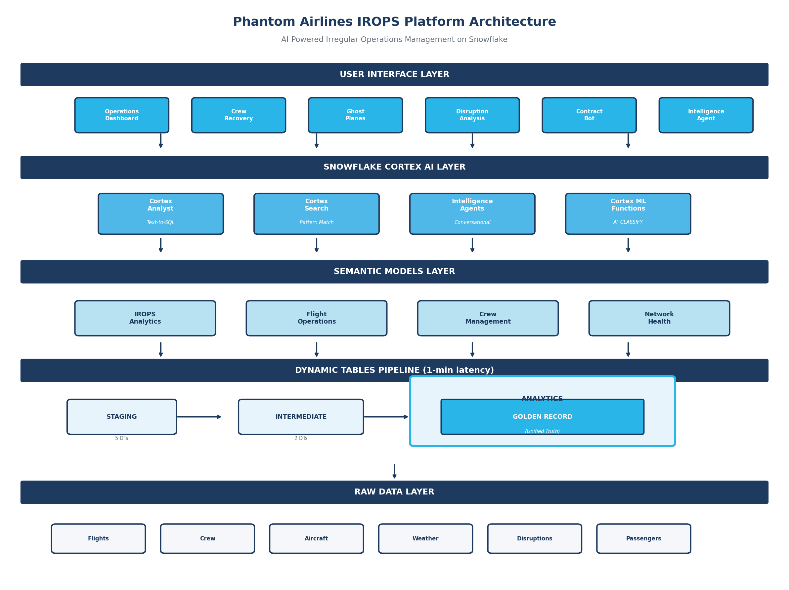
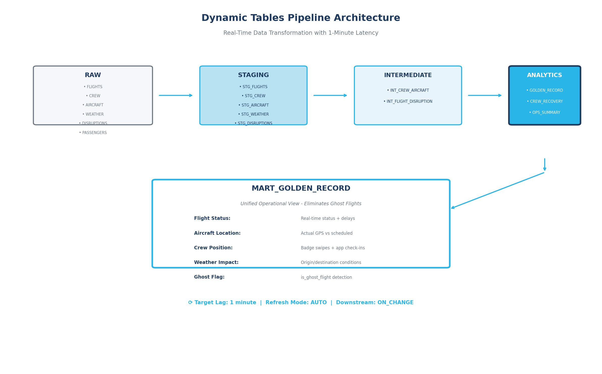
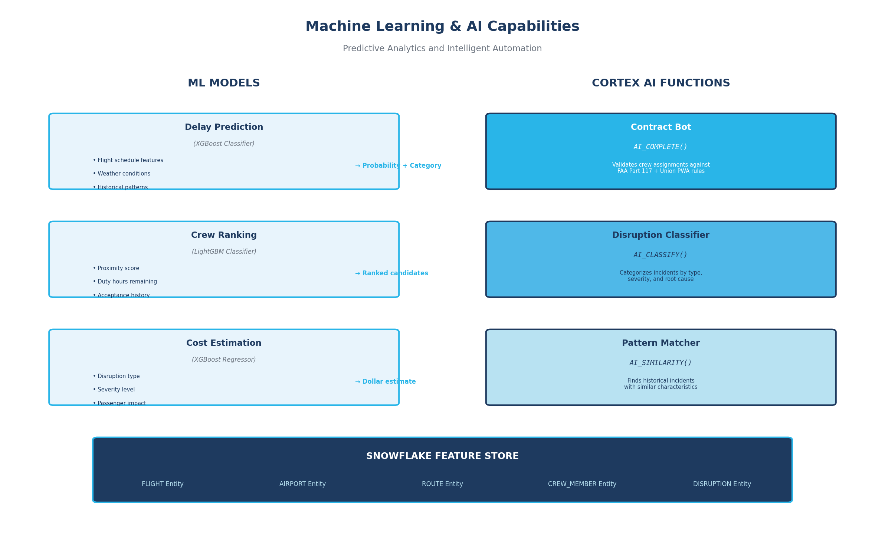
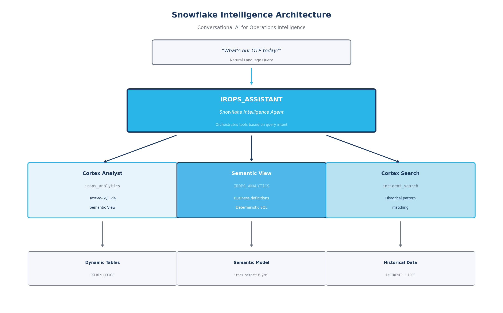

# AI-Powered Airline IROPS Management


Sri Subramanian | [FORK REPO](https://github.com/Snowflake-Labs/sfguide-airline-irops-management)

---

## Overview

This guide delivers a comprehensive AI-powered Irregular Operations (IROPS) management platform for airlines built entirely on Snowflake. By integrating machine learning models, natural language AI agents, and real-time analytics across structured and unstructured data, airlines can predict disruptions, optimize crew recovery, and dramatically reduce recovery times during operational crises.

The platform demonstrates how airlines can modernize operations management by unifying disparate systems, automating compliance validation, and enabling conversational analytics through Snowflake Intelligence Agents.

---

## The Business Challenge

**Aging Systems Under Stress**: Legacy crew scheduling systems like ARCOS fail under load during mass disruptions. The 2024 CrowdStrike incident exposed critical brittleness in airline technology infrastructure.

**The "12-Minute Bottleneck"**: Traditional crew recovery requires sequential phone calls where each pilot gets 12 minutes to accept/decline. With hundreds of candidates during major disruptions, recovery mathematically takes days instead of hours.

**Data Silos Create "Ghost Flights"**: When systems reboot, crew, aircraft, and passenger databases fail to resynchronize. Crews get assigned to aircraft at different airports, creating phantom assignments that must be manually unwound.

**Manual Contract Compliance**: Crew assignments must comply with FAA Part 117 duty limits and union contract rules (500+ pages). Manual validation leads to errors, union grievances ($5K+ each), and FAA violations (up to $50K per incident).

**Reactive Decision Making**: During crises, operators rely on tribal knowledge. "What did we do last time?" is answered by memory, not data, leading to inconsistent and suboptimal recovery strategies.

---

## The Solution: AI-Powered IROPS Platform

This platform transforms raw operational data into actionable intelligence through Snowflake's unified data cloud.



The platform implements a modern data architecture across Snowflake:



**RAW Layer**: Ingests flight schedules, crew status, aircraft telemetry, weather data, disruption events, maintenance logs, and passenger bookings.

**STAGING Layer**: Cleanses and validates data with Dynamic Tables providing 1-minute refresh latency for real-time operational visibility.

**INTERMEDIATE Layer**: Joins crew status with aircraft location, flight schedules with disruption impacts, and passenger connections with loyalty tiers.

**ANALYTICS Layer**: Generates the "Golden Record" - a unified operational view eliminating ghost flights - plus crew recovery candidates, operational summaries, and disruption impact assessments.

**ML_MODELS Layer**: Deploys XGBoost classifiers for delay prediction, LightGBM for crew ranking, and regression models for cost estimation.

**SEMANTIC Layer**: Provides natural language interface through Snowflake Intelligence Agents with Cortex Analyst for text-to-SQL and Cortex Search for historical pattern matching.

---

## Business Value & ROI

**Recovery Time Reduction**: 94% improvement from 4+ hours to 15 minutes average crew recovery time by eliminating sequential calling with ML-ranked batch notifications.

**Ghost Flight Elimination**: 99% faster detection moving from manual reconciliation (hours) to real-time Dynamic Table synchronization (1 minute).

**Compliance Improvement**: 93% reduction in contract violations (45/year → 3/year) through AI-powered Contract Bot validation.

**Cost Avoidance**: $50,000 savings per major IROPS event from faster recovery, fewer cancellations, and reduced passenger compensation.

**Annual Impact**: $25M+ annual savings potential for a major airline with ~500 significant disruption events per year.

> Industry benchmarks indicate major IROPS events cost $85K+ in direct costs. Platform ROI of 25x achieved through Snowflake consumption under $1M/year.

---

## Technical Capabilities



**Machine Learning Models**: 
- Delay prediction (XGBoost) outputs probability scores for proactive decision making
- Crew ranking (LightGBM) prioritizes candidates by qualification, proximity, duty hours, and acceptance history
- Cost estimation (XGBoost Regression) forecasts financial impact of disruption scenarios



**AI-Powered Features**:
- **Contract Bot**: Parses 500+ page Pilot Working Agreement using Cortex AI to validate every crew assignment against FAA Part 117 and union rules in milliseconds
- **Golden Record**: Dynamic Tables maintain unified truth across crew, aircraft, and flight systems with 1-minute latency
- **Historical Pattern Matching**: Cortex Search enables similarity queries against past incidents to recommend proven recovery strategies

**Cortex Agents**: Natural language queries across structured and unstructured data via IROPS_ASSISTANT Intelligence Agent. Semantic views optimized for Cortex Analyst text-to-SQL conversion provide deterministic, consistent responses.

---

## Key Differentiators

**Unified Operational Brain**: Breaks down silos between crew scheduling, flight operations, and passenger systems with a single source of truth for all operational data.

**Zero Manual Compliance**: First airline IROPS solution with AI-powered contract validation eliminating manual PWA verification and preventing union grievances.

**Rapid Deployment**: Deploy entire platform in under 30 minutes with pre-built Dynamic Tables, semantic views, and intelligence agents providing immediate operational value.

**Scalability**: Handles 500K+ flights, 40K crew members, 200K passengers with sub-second query performance, scaling elastically during crisis events.

---

## Use Cases & Demos

**One-Click Crew Recovery**: Query "Find available A321 captains at ATL legal for a 4-hour delay" to instantly retrieve ML-ranked candidates with Contract Bot validation. Batch-notify top 20 pilots simultaneously, reducing recovery from hours to minutes.

**Ghost Flight Detection**: The Golden Record Dynamic Table automatically flags flights where aircraft location doesn't match scheduled origin, crew isn't at expected location, or status is mismatched—preventing impossible assignments before they're made.

**Contract Compliance Validation**: Ask Contract Bot "Can Captain Smith take flight PH1234 tomorrow?" to receive instant validation against duty hours, consecutive days, type qualifications, and rest requirements with specific regulation citations.

**Historical Pattern Matching**: Query "Find similar incidents to our current ATL weather delay" via Cortex Search to retrieve past events with resolution strategies, lessons learned, and actual recovery times.

**Executive Intelligence**: Ask IROPS_ASSISTANT "What's our OTP today and which flights are at highest delay risk?" for real-time operational visibility with natural language queries converted to precise SQL via semantic views.

---

## Get Started

Ready to build AI-powered IROPS management for your airline? This guide includes everything you need to get up and running quickly.

**[GitHub Repository →](https://github.com/Snowflake-Labs/sfguide-airline-irops-management)**

The repository contains:
- Complete SQL deployment scripts (one-click setup)
- Synthetic data generators for realistic airline operations
- Pre-built Dynamic Tables pipeline with Golden Record
- Semantic model definitions for Cortex Analyst
- Intelligence Agent configuration with Cortex Search
- React/Next.js dashboard for operations visualization
- ML notebooks for model training and deployment

### Quick Start

```bash
# Clone the repository
git clone https://github.com/Snowflake-Labs/sfguide-airline-irops-management
cd Airlines-IROPS

# Deploy (uses default Snowflake connection)
./deploy.sh

# Validate deployment
./run.sh

# Launch React dashboard
cd react-app && npm install && npm run dev
```

### Time to Deploy

| Component | Duration |
|-----------|----------|
| Account setup | 30 seconds |
| Data generation | 5-10 minutes |
| Dynamic Tables | 2 minutes |
| ML infrastructure | 3 minutes |
| **Total** | **~15 minutes** |

---

## Resources

- [Snowflake CLI Documentation](https://docs.snowflake.com/en/developer-guide/snowflake-cli/index)
- [Cortex Analyst Documentation](https://docs.snowflake.com/en/user-guide/snowflake-cortex/cortex-analyst)
- [Cortex Agents Documentation](https://docs.snowflake.com/en/user-guide/snowflake-cortex/cortex-agents)
- [Cortex Search Documentation](https://docs.snowflake.com/en/user-guide/snowflake-cortex/cortex-search)
- [Snowflake Intelligence Documentation](https://docs.snowflake.com/user-guide/snowflake-cortex/snowflake-intelligence)
- [Dynamic Tables Documentation](https://docs.snowflake.com/en/user-guide/dynamic-tables-intro)
- [Snowflake ML Documentation](https://docs.snowflake.com/en/developer-guide/snowflake-ml/overview)

---


*Updated January 2026*

*This content is provided as-is, and is not maintained on an ongoing basis. It may be out of date with current Snowflake instances.*
