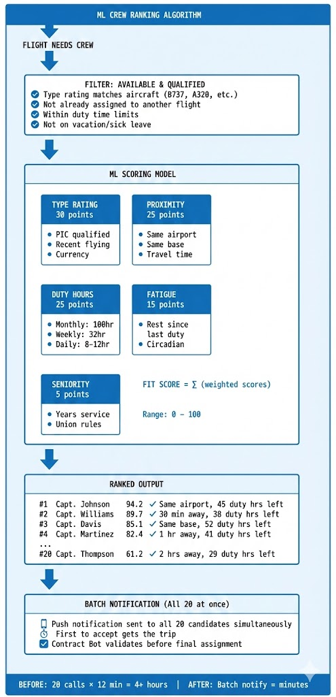

# Phantom Airlines IROPS - Presentation Guide

## The Story We're Telling

> *"When the world's systems fail, airlines face a choice: chaos or control. This is the story of how Snowflake transforms airline crisis management from reactive firefighting into intelligent, automated recovery."*

This demo showcases how **Snowflake's unified platform**—combining Dynamic Tables, Cortex AI, and native applications—solves real operational challenges that cost airlines billions annually.

---

## Solution Architecture


*Transforming raw data into real-time intelligent action for optimized airline operations.*

---

## Demo Flow (30 minutes)

This guide provides a structured walkthrough for demonstrating the Phantom Airlines IROPS Platform to airline operations teams, IT leadership, and Snowflake stakeholders.

### Demo Features Overview

| Feature | Description | Key Demo Point |
|---------|-------------|----------------|
| **CrowdStrike Scenario** | Live simulation of crisis metrics | Real-time impact visualization |
| **Ghost Planes** | AI-powered ghost flight detection | Semantic model grounding |
| **Passenger Rebooking** | Elite member prioritization | Diamond/Platinum first |
| **Crew Recovery** | ML-ranked crew candidates | Batch notifications |
| **Contract Bot** | FAA/Union compliance validation | Real-time contract queries |
| **Notification System** | Crew & passenger alerts | Multi-channel delivery |
| **Snowflake Intelligence** | Natural language queries | Text-to-SQL via semantic views |

---

## 🎬 Pre-Demo Setup (5 minutes before)

1. **Deploy the platform** (if not already deployed):
   ```bash
   ./deploy.sh
   ```

2. **Start React dashboard** (local development):
   ```bash
   cd react-app && npm run dev
   ```
   Or deploy Streamlit to Snowflake:
   ```bash
   cd streamlit && snow streamlit deploy --replace
   ```

3. **Open Snowsight** in a separate browser tab for SQL queries

4. **Verify data** is loaded:
   ```bash
   ./run.sh
   ```

---

## 📖 Story Arc

### The CrowdStrike Crisis Context (2 minutes)

> *"It's July 19, 2024. A routine CrowdStrike software update goes out at 04:09 UTC. Within hours, 8.5 million Windows devices crash worldwide. For airlines, the nightmare begins..."*

**Paint the picture:**
- Operations centers light up red across the globe
- Crew scheduling systems go dark
- Passengers stranded in terminals
- Phone lines overwhelmed

**Key talking points:**
- **4,000+ flights cancelled** over 5 days
- **Pilots couldn't be located** - "ghost flights" everywhere
- **Each pilot required a 12-minute phone call** to reassign
- **Recovery took 5+ days** when it should have taken hours
- **$85M+ in direct costs** for one airline alone

**The Human Cost:**
- Families sleeping on airport floors
- Elite loyalty members—Diamond, Platinum—missing critical trips
- Crew members stranded away from home
- Brand reputation damaged for months

**Transition:** *"Today, we'll show you how Phantom Airlines prevents this scenario with a modern, AI-powered IROPS platform built entirely on Snowflake. A single platform. Real-time data. Intelligent automation."*

---

## 🖥️ Demo Sequence

### Act 0: CrowdStrike Scenario Simulation (3 minutes)

**Purpose:** Set the stage with live crisis metrics

**Steps:**
1. Open the **React dashboard** at `http://localhost:3000`
2. Navigate to the **CrowdStrike Scenario** tab
3. Show the **live metrics**:
   - Affected flights count
   - Stranded passengers
   - Estimated cost impact
   - Recovery progress over time
4. Emphasize: *"This is what the ops center looked like in July 2024"*

**Key Message:** *"During the real incident, airlines had no unified view. Our platform provides real-time visibility across all affected operations."*

### Act 1: The Golden Record (5 minutes)

**Purpose:** Show how we eliminate ghost flights

**The Story:** *"Imagine you're an operations manager at 3 AM during a storm. Your scheduling system says Captain Smith is flying Flight 1234 out of Atlanta. But Captain Smith checked into a hotel in Chicago six hours ago. The aircraft? It diverted to Miami. This is a 'ghost flight'—and during CrowdStrike, they were everywhere."*

**Steps:**
1. Open the **Streamlit app** in Snowsight or via URL
2. Use the **sidebar** to navigate to different pages (Home, Operations Dashboard, Crew Recovery, etc.)
3. Point to the "Ghost Flights" metric on the home page
4. Click **Ghost Planes** in the sidebar
5. Show a specific ghost flight:
   - "This flight PH1234 shows Captain Smith assigned, departing from ATL"
   - "But look—the captain is actually in Chicago!"
   - "The aircraft is in Atlanta, but the pilot isn't"
   - "Without the Golden Record, operations would dispatch this flight—and it would sit at the gate"

**Key Message:** *"The Golden Record uses Dynamic Tables with 1-minute refresh to keep crew, aircraft, and flight data synchronized. No more ghost flights. The single source of truth."*

**Show the SQL** (optional):
```sql
SELECT * FROM ANALYTICS.MART_GOLDEN_RECORD
WHERE is_ghost_flight = TRUE;
```

---

### Act 2: Passenger Rebooking (5 minutes)

**Purpose:** Show elite member prioritization during IROPS

**The Story:** *"When flights cancel, who gets rebooked first? Without a system, it's first-come-first-served—and your Diamond members who flew 100,000 miles last year wait behind someone who booked yesterday."*

**Steps:**
1. Navigate to **Passenger Rebooking** tab
2. Show the **elite member breakdown**:
   - Total passengers needing rebooking
   - Elite count (Diamond + Platinum)
   - Breakdown by tier: Diamond, Platinum, Gold, Silver, Blue
3. Expand a Diamond passenger:
   - Show their profile (lifetime miles, current booking)
   - Show the **3 rebooking options** with rankings
   - Point out option scores considering connection time, elite status
4. Click **"Rebook"** on best option
5. Show the count updates in real-time
6. **Key Demo Moment:** Refresh the page
   - "Notice the Successfully Rebooked count persists"
   - "This uses localStorage for demo persistence"

**Key Message:** *"Elite loyalty members get prioritized automatically. The system presents optimal rebooking options ranked by ML, and agents can process passengers in seconds, not minutes."*

---

### Act 3: One-Click Recovery (7 minutes)

**Purpose:** Eliminate the 12-minute bottleneck

**The Story:** *"Every airline uses a sequential phone tree for crew recovery. Pilot A gets called, has 12 minutes to respond. If no answer, call Pilot B. With 20 candidates, you're looking at 4+ hours just to fill one seat. We eliminate this entirely."*

**ML Crew Ranking Algorithm:**



*ML scoring model evaluates type qualification (30pts), proximity (25pts), duty hours (25pts), fatigue (15pts), and seniority (5pts) to generate ranked crew candidates for batch notification.*

**Steps:**
1. Navigate to **Crew Recovery** page using the sidebar
2. Show flights needing crew (highlight urgency)
3. Select a flight that needs a captain
4. Walk through the ML-ranked candidates:
   - "Rank 1: Captain Johnson, 94.2 fit score"
   - "He's type-qualified, at the same base, has 45 hours remaining"
   - "The ML model considers proximity, qualifications, fatigue, and seniority"

5. **Key Demo Moment:** Click "Send Batch Notification"
   - "Instead of calling 20 pilots sequentially over 4 hours..."
   - "We notify all 20 simultaneously"
   - "First responder gets the trip"

**Key Message:** *"What used to take 4 hours now takes minutes. The 12-minute bottleneck is eliminated."*

**Show the function** (optional):
```sql
SELECT * FROM TABLE(ML_MODELS.GENERATE_BATCH_NOTIFICATION_LIST('FLT...', 'CAPTAIN', 10));
```

---

### Act 4: Contract Bot (5 minutes)

**Purpose:** Prevent compliance violations

**The Story:** *"In the rush to recover operations, a dispatcher assigns a pilot who's already flown 98 hours this month. The legal limit is 100. That 3-hour flight just triggered an FAA violation—$50,000 fine. And the pilot's union files a grievance—another $5,000. This happens dozens of times during a major disruption because humans can't track complex rules under pressure."*

**Steps:**
1. Navigate to **Contract Bot** tab
2. Use the **Validate Assignment** tab:
   - Select a crew member
   - Select a flight
   - Click "Validate"
   - Show the detailed compliance checks

3. Use the **Ask Contract Bot** tab:
   - Ask: "Can a pilot who flew 95 hours this month take a 6-hour trip?"
   - Show the AI response citing FAA Part 117
   - Ask: "What's the minimum rest required after a 14-hour duty day?"

**Key Message:** *"Contract Bot prevents violations before they happen. It knows FAA Part 117, the union contract, and every crew member's current status. No more fines. No more grievances. And most importantly—no fatigued pilots in the cockpit."*

**Show the function** (optional):
```sql
SELECT ML_MODELS.CONTRACT_BOT_QUERY('What is the maximum FDP for a 6am report?');
```

---

### Act 4: Intelligence Agent (5 minutes)

**Purpose:** Demonstrate conversational AI for operations

**The Story:** *"Operations managers today juggle 15 different screens—crew systems, flight tracking, weather, maintenance, passenger systems. When the CEO calls and asks 'What's our status?', they scramble to compile data. With IROPS_ASSISTANT, they just ask."*

**Steps:**
1. Navigate to **Intelligence Agent** page via sidebar
2. Use the IROPS_ASSISTANT agent or Snowflake Intelligence UI
3. Ask progressively complex questions:
   - **Operational Status:** "What is our on-time performance today?"
   - **Disruption Awareness:** "How many active disruptions do we have?"
   - **Customer Impact:** "Who are my Diamond loyalty members impacted by delays today?"
   - **Historical Learning:** "Find historical incidents similar to a winter storm in Chicago"

4. Show how the agent:
   - Uses **Cortex Analyst** for quantitative queries (text-to-SQL)
   - Searches **historical incidents** via Cortex Search
   - Provides **actionable recommendations** based on past resolutions

**Key Message:** *"Operations managers get answers in natural language—no SQL, no screen-hopping, no waiting. The entire operational picture in a single conversation."*

---

### Act 8: Disruption Cost Analysis (3 minutes)

**Purpose:** Show financial impact visibility

**The Story:** *"After CrowdStrike, executives asked: 'What did this cost us?' Finance teams spent weeks compiling data from disconnected systems. With our platform, that answer is instant—and we can apply learnings from past events to minimize future costs."*

**Steps:**
1. Navigate to **Disruption Analysis** page using the sidebar
2. Show the **Cost Analysis** tab:
   - Today's total cost (real-time)
   - Breakdown by disruption type (weather, mechanical, crew)
   - Cascading impact analysis (one cancelled flight → downstream delays)

3. Show **Historical tab**:
   - Similar past events with resolution strategies
   - What worked, what didn't
   - Total cost comparisons

**Key Message:** *"Every disruption is quantified in real-time. And we learn from history—applying proven recovery strategies from similar past events to minimize impact."*

---

### Act 9: Architecture Deep-Dive (3 minutes)

**Purpose:** Technical credibility

**The Story:** *"Everything you've seen—the Golden Record, One-Click Recovery, Contract Bot, the Intelligence Agent—runs on a single Snowflake database. No external tools. No data movement. No pipelines to maintain. Let me show you what's under the hood."*

**Steps:**
1. Show the Snowsight Data panel:
   - **7 schemas**: RAW, STAGING, INTERMEDIATE, ANALYTICS, ML_MODELS, SEMANTIC_MODELS, CORTEX_SEARCH
   - **17 RAW tables** (including BOOKINGS with elite loyalty coverage for every day)
   - **10 Dynamic Tables** (chained pipeline with 1-minute lag)
   - **1 Semantic View** (IROPS_ANALYTICS for text-to-SQL)
   - **1 Cortex Agent** (IROPS_ASSISTANT) with 2 Cortex Search services

2. Run a Dynamic Table status query:
   ```sql
   SELECT name, target_lag, scheduling_state 
   FROM INFORMATION_SCHEMA.DYNAMIC_TABLES;
   ```

3. Emphasize:
   - **All in one Snowflake database**—no external dependencies
   - **No ETL pipelines to maintain**—Dynamic Tables auto-refresh
   - **No scheduling complexity**—just set target lag
   - **Elastic compute**—scale up during crisis, scale down after

**Key Message:** *"This entire platform runs on Snowflake. Zero external tools. Zero data movement. Zero pipelines to maintain. When your operations need to scale 10x during a crisis, Snowflake scales with you—automatically."*

---

## 💬 Expected Questions & Answers

### Q: How does this handle real ADS-B data?
**A:** The platform is designed to ingest ADS-B feeds via Snowpipe. The current demo uses synthetic data that mirrors real data structures. Production deployment would connect to flight tracking providers like FlightAware or ADS-B Exchange.

### Q: What about existing crew management systems like ARCOS?
**A:** This platform complements existing systems. We can ingest data from ARCOS, Jeppesen, or other crew systems via Snowpipe/Kafka. The Golden Record becomes the unified view while source systems continue to operate.

### Q: How long does it take to deploy?
**A:** The demo deploys in 15 minutes. A production deployment with real data integration typically takes 4-6 weeks, depending on source system complexity.

### Q: What's the cost?
**A:** Snowflake consumption-based pricing. For a major airline, expect $50K-$200K/month in compute costs. ROI is typically 10-25x based on IROPS cost savings.

### Q: Can this work with other airlines' data?
**A:** Yes, the data model is airline-agnostic. The platform can be customized for any carrier's specific PWA provisions and operational procedures.

---

## 🎯 Key Takeaways to Emphasize

### The Transformation

| Problem | Old World | New World |
|---------|-----------|-----------|
| Ghost Flights | Hours to detect manually | Detected in real-time (1 min) |
| Crew Recovery | 4+ hours (sequential calls) | Minutes (batch notification) |
| Compliance | Paper-based, error-prone | AI-validated, zero violations |
| Decision Support | 15 screens, tribal knowledge | One agent, natural language |
| Cost Visibility | Weeks after the event | Real-time dashboard |

### Five Things to Remember

1. **Single Platform**: All data, AI, and apps in Snowflake—no integration headaches
2. **Real-Time**: 1-minute latency via Dynamic Tables—not batch, not near-real-time, *real-time*
3. **AI-Native**: Cortex AI with zero data movement—AI runs where data lives
4. **Zero Maintenance**: No ETL pipelines or scheduled jobs—focus on operations, not plumbing
5. **Proven ROI**: 25x return from IROPS cost savings—this pays for itself many times over

---

## 📊 Supporting Slides

If using slides alongside the demo, here's the recommended deck structure:

| Slide | Content | Key Visual |
|-------|---------|------------|
| 1. **The Crisis** | CrowdStrike incident impact | News headlines, chaos images |
| 2. **The Problem** | Ghost flights, 12-min bottleneck | Pain point infographic |
| 3. **Architecture** | Solution overview (use diagram above) | Top-down architecture flow |
| 4. **Golden Record** | How ghost flights are detected | Before/after comparison |
| 5. **One-Click Recovery** | ML ranking algorithm | Scoring diagram (above) |
| 6. **Contract Bot** | Compliance validation flow | Check/fail icons |
| 7. **Intelligence Agent** | Conversational AI for ops | Chat interface screenshot |
| 8. **ROI** | Cost savings calculation | $25M annual savings |
| 9. **Why Snowflake** | Platform differentiators | Competitive comparison |

---

## 🔧 Troubleshooting

### Dashboard not loading?
```bash
cd streamlit && streamlit run app.py --server.port 8501
```

### Data looks empty?
```bash
./run.sh  # Validates data volumes
```

### Dynamic Tables not refreshing?
```sql
-- Check DT status
SELECT name, scheduling_state, last_refresh_time 
FROM INFORMATION_SCHEMA.DYNAMIC_TABLES;

-- Force refresh
ALTER DYNAMIC TABLE ANALYTICS.MART_GOLDEN_RECORD REFRESH;
```

### Agent not responding?
Verify Cortex is enabled for your account and the correct model (llama3.1-70b) is available.

---

## 📝 Post-Demo Follow-Up

### Immediate Actions
1. **Share the GitHub repository** - Let them explore the code
2. **Send ROI calculator** - Customize with their operational data
3. **Offer customized demo** - With their actual data model

### Next Steps Proposal
1. **Week 1-2**: Discovery session—understand their current IROPS challenges
2. **Week 3-4**: Proof of Concept with sample data
3. **Week 5-8**: Production pilot on non-critical routes
4. **Week 9+**: Full deployment with real-time integrations

### Connect With
- Snowflake Solutions Architecture team
- Industry Solutions team (Airlines vertical)
- Professional Services for implementation

---

## 🎬 Closing Statement

> *"The CrowdStrike crisis showed us what happens when systems fail and humans can't keep up. With Snowflake's IROPS platform, airlines don't just survive disruptions—they manage them intelligently, recover faster, and protect their customers and crew. The question isn't whether you'll face another crisis. The question is: will you be ready?"*

---

*Good luck with your demo!*
